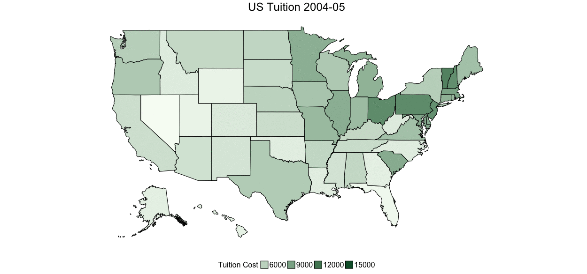

## Investigating US Tuition Costs

```{r setup, include=FALSE}
knitr::opts_chunk$set(echo = TRUE)
library(tidyverse)
library(readxl)
```

[RAW DATA](https://github.com/rfordatascience/tidytuesday/blob/master/data/us_avg_tuition.xlsx)  
[DataSource](https://onlinembapage.com/average-tuition-and-educational-attainment-in-the-united-states/)  
[Original Graphic](https://onlinembapage.com/wp-content/uploads/2016/03/AverageTuition_Part1b.jpg)  

```{r parse}
tuition <- read_xlsx("../data/us_avg_tuition.xlsx")
tuition
```

Looking at this I can tell this is going to be ideal for a spatial plot. So I need some 
US states! Since it's through time I think I might also try to animate it with `gganimate`!
```{r}
# get case to all lower for id to match
data <- tuition %>%
  mutate(id = tolower(State)) %>%
  gather(year, cost, -id, -State)
```

```{r, eval = FALSE}
library(gganimate)
library(fiftystater)

# map_id creates the aesthetic mapping to the state name column in your data
p <- ggplot(data, aes(frame = year, map_id = id)) +
  # map points to the fifty_states shape data
  geom_map(aes(fill = cost), color = "black", map = fifty_states) +
  expand_limits(x = fifty_states$long, y = fifty_states$lat) +
  coord_map() +
  scale_x_continuous(breaks = NULL) +
  scale_y_continuous(breaks = NULL) +
  labs(x = "", y = "") +
  theme(
    legend.position = "bottom",
    panel.background = element_blank(),
    plot.title = element_text(hjust = 0.5, size = 24),
    legend.text = element_text(size = 16),
    legend.title = element_text(size = 16)
  ) +
  guides(fill = guide_legend(title = "Tuition Cost")) +
  ggtitle("US Tuition") +
  scale_fill_gradient(low = "#f7fcf5", high = "#005a32")
p

animation::ani.options(interval = .5)

gganimate(p, ani.width = 1250, ani.height = 585, "tuition.gif", title_frame = TRUE)
```



What's going on with Illinois?

Could be cool to plot rate of change instead:

```{r}
library(lubridate)
rates <- data %>%
  mutate(yr_start = mdy(
    paste0("08-01-", str_split(year, "[-]") %>% map_chr(., ~ .[1]))
  )) %>%
  group_by(id) %>%
  mutate(diff_pct = c(0, diff(cost)) / cost)
```

```{r, eval = FALSE}
# map_id creates the aesthetic mapping to the state name column in your data
p2 <- ggplot(rates, aes(frame = year, map_id = id)) +
  # map points to the fifty_states shape data
  geom_map(aes(fill = diff_pct), color = "black", map = fifty_states) +
  expand_limits(x = fifty_states$long, y = fifty_states$lat) +
  coord_map() +
  scale_x_continuous(breaks = NULL) +
  scale_y_continuous(breaks = NULL) +
  labs(x = "", y = "") +
  theme(
    legend.position = "bottom",
    panel.background = element_blank(),
    plot.title = element_text(hjust = 0.5, size = 24),
    legend.text = element_text(size = 16),
    legend.title = element_text(size = 16)
  ) +
  guides(fill = guide_legend(title = "Annual Percent Change")) +
  ggtitle("Annual Percent Change in US Tuition") +
  scale_fill_gradient(
    low = "white", high = "#005a32",
    breaks = c(0, 1, 2, 3, 4, 5, 6, 7, 8, 9, 10)
  )
p2

animation::ani.options(interval = 1)

gganimate(p2, ani.width = 1250, ani.height = 585, "rates.gif", title_frame = TRUE)
```


A good example where an animation **does not** make the story clearer!

Let's play with the `geofacet` library, see if that can clear things up!

```{r}
library(geofacet)

ts <- rates %>%
  ungroup() %>%
  select(-id, -diff_pct) %>%
  mutate_if(is.character, as.factor) %>%
  mutate(ease = "linear", year = as.numeric(year(yr_start) - min(year(yr_start)) + 1))

ggplot(ts, aes(year, cost)) +
  geom_line() +
  facet_geo(~ State, grid = "us_state_grid3") +
  scale_x_continuous(breaks = NULL) +
  scale_y_continuous(breaks = NULL) +
  labs(
    title = "Average US State Tuition Costs 2004-2015",
    caption = "Data Source: onlinembapage.com",
    x = "Year",
    y = "Tuition Cost (%)"
  ) +
  theme(strip.text.x = element_text(size = 6), plot.title = element_text(hjust = .5))
```

Nice function but the plots are too small for informative axes and the visualization
doesn't quite have the overall punch I would like. 

Let's try making a smooth animated time series plot with a little interpolation help from `tweenr`!
```{r, eval = FALSE}
#### playing with tweenr
## Code adapted from: http://lenkiefer.com/2018/03/18/pipe-tweenr/

library(tweenr)
library(animation)

# filter to just interesting states
ts_fil <- ts %>% 
  filter(State %in% c("California", "Vermont", "Illinois", "Wyoming", 
                      "Washington", "Florida"))

plot_tween <- tween_elements(ts_fil, time = "year", group = "State", 
                             ease = "ease", nframes = 48)
df_tween <- tween_appear(plot_tween, time = "year", nframes = 48)

# add pause at end of animation
df_tween <- df_tween %>% keep_state(20)
summary(df_tween)

make_plot <- function(i) {
  plot_data <-
    df_tween %>%
    filter(.frame == i, .age > -.5)
  p <- plot_data %>%
    ggplot() +
    geom_line(aes(x = yr_start, y = cost, color = .group), size = 1.3) +
    geom_point(
      data = . %>% filter(yr_start == max(yr_start)),
      mapping = aes(x = yr_start, y = cost, color = .group),
      size = 3, stroke = 1.5
    ) +
    geom_point(
      data = . %>% filter(yr_start == max(yr_start)),
      mapping = aes(x = yr_start, y = cost, color = .group), size = 2
    ) +
    geom_text(
      data = . %>% filter(yr_start == max(yr_start)),
      mapping = aes(
        x = yr_start, y = cost, label = .group,
        color = .group
      ), nudge_x = 7, hjust = -0.4, fontface = "bold"
    ) +
    geom_line(data = ts, aes(x = yr_start, y = cost, group = State), 
              alpha = 0.25, color = "darkgray") +
    theme_minimal(base_family = "sans") +
    scale_color_manual(values = c("#fec44f", "#253494", "#f46d43", 
                                  "#1a9850", "#542788", "#993404")) +
    scale_x_date(
      limits = c(as.Date("2004-08-01"), as.Date("2016-01-01")),
      date_breaks = "1 year", date_labels = "%Y"
    ) +
    theme(
      legend.position = "none",
      plot.title = element_text(face = "bold", size = 24, hjust = .5),
      plot.caption = element_text(hjust = .5, size = 10),
      axis.title.y = element_text(size = 14),
      axis.text.x = element_text(size = 12),
      axis.text.y = element_text(size = 12),
      panel.grid.major.x = element_line(color = "lightgray"),
      panel.grid.minor.x = element_line(color = "lightgray"),
      panel.grid.major.y = element_line(color = "lightgray"),
      panel.grid.minor.y = element_line(color = "lightgray")
    ) +
    labs(
      x = "", y = "Tuition Cost",
      title = "US Tuition by State",
      caption = "Tidy Tuesday Week 1, Data Source: onlinembapage.com, code with considerable help from @lenkiefer's 3/18/18 blog post"
    )
  return(p)
}

oopt <- ani.options(interval = 1 / 10)
saveGIF({
  for (i in 1:max(df_tween$.frame)) {
    g <- make_plot(i)
    print(g)
    print(paste(i, "out of", max(df_tween$.frame)))
    ani.pause()
  }
}, movie.name = "tuition2.gif", ani.width = 700, ani.height = 540)
```


In order to promote readibility I had to select a subset of states but still pretty cool! Especially given my best attempt to match school colors! Now we can really see tuition is rising steadily! I wonder how it compares to inflation... a visualization for another time perhaps!

