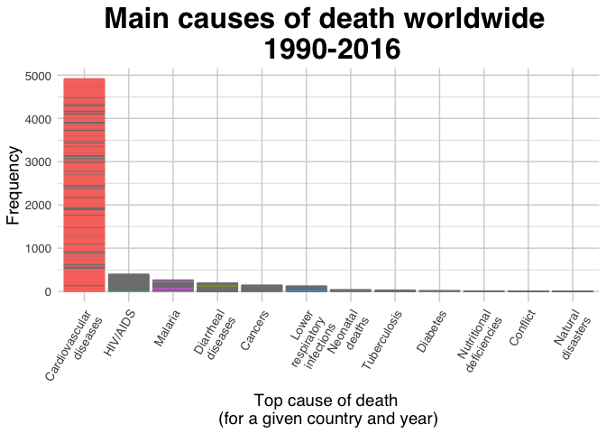
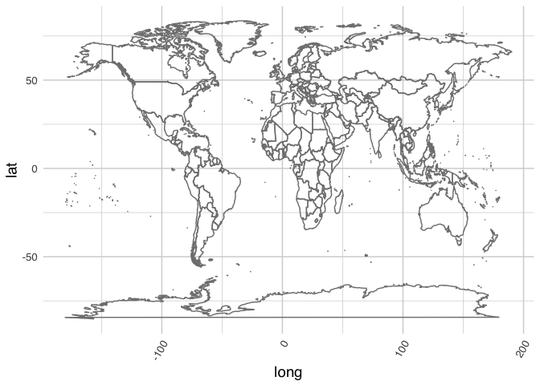

Tidy Tuesday 3: Worldwide Mortality Data
================
Dana Seidel
4/26/2018

Load the data and libraries
===========================

``` r
library(readxl)
suppressPackageStartupMessages(library(tidyverse))

mortality <- read_xlsx("../data/global_mortality.xlsx")

mortality_long <- mortality %>%
  gather(cause, percentage, -country, -country_code, -year) %>%
  mutate_if(is.character, factor)
```

Specify my theme
================

``` r
my_theme <-  theme_minimal(base_family = "sans") + theme(
  legend.position = "none",
  plot.title = element_text(face = "bold", size = 24, hjust = .5),
  plot.caption = element_text(hjust = .5, size = 10),
  axis.title.y = element_text(size = 14),
  axis.title.x = element_text(size = 14),
  axis.text.x = element_text(size = 10, angle = 60, hjust = 1),
  axis.text.y = element_text(size = 10),
  panel.grid.major.x = element_line(color = "lightgray"),
  panel.grid.minor.x = element_line(color = "lightgray"),
  panel.grid.major.y = element_line(color = "lightgray"),
  panel.grid.minor.y = element_line(color = "lightgray")
)
```

Identify the main killers per year per country
==============================================

``` r
main_killers <- mortality_long %>%
  group_by(country, year) %>%
  summarise(
    main_cause = cause[which(percentage == max(percentage, na.rm = T))] %>% 
      str_remove(., "\\s+[(%)]+") %>% str_replace_all(" ", "\n"), 
    percentage = max(percentage, na.rm = T)
  ) # hot damn, look at that regex :)
```

Make a basic plot
=================

``` r
# basic plot
ggplot(main_killers, aes(x = fct_infreq(main_cause))) + #LOVE me some forcats
  geom_bar(position = "dodge") + 
  my_theme +
  ggtitle("Main causes of death worldwide \n 1990-2016") +
  ylab("Frequency") +
  xlab("Top cause of death \n(for a given country and year)")
```



Okay. While I think that's beautiful, it's admittedly not the best communication tool. It looks like a skyline :waxing\_gibbous\_moon: :city\_sunset: :smile:

Still some things we can do with this for more effective visualization: - we could color code by continent - we could animate through time how these things change. - we could plot these "main" causes on a world map to see spatial disparities - we could animate that map...

Have I gone a little animation crazy???


``` r
# Map
library(ggplot2)
mapWorld <- borders("world") # create a layer of borders
```

    ## 
    ## Attaching package: 'maps'

    ## The following object is masked from 'package:purrr':
    ## 
    ##     map

``` r
ggplot(mortality_long, aes(map_id = country)) + mapWorld + my_theme
```


