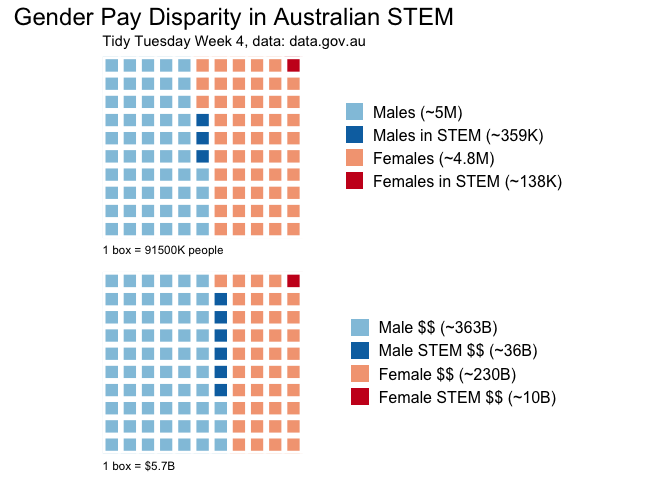

Tidy Tuesday 4:
================
Dana Seidel
5/18/2018

Load data and libraries
-----------------------

``` r
library(tidyverse)
library(printr)

salaries <- read_csv("../data/week4_australian_salary.csv")
# looks like we are likely going to need some stringr to categorize these.

# Let's look at just STEM fields broadly
STEM <- salaries %>% 
  filter(str_detect(occupation, "scien") | str_detect(occupation, "comput") |
       str_detect(occupation, "engineer") | str_detect(occupation, "medic"),  
       !(str_detect(occupation, "s*ales")))


# Build that into the salaries df directly
df_sal <- salaries %>% 
  mutate(STEM = ifelse(
    (str_detect(occupation, "scien") | str_detect(occupation, "comput") |
       str_detect(occupation, "engineer") | str_detect(occupation, "medic") & 
       !(str_detect(occupation, "s*ales"))), 1, 0))
```

Let's look at gender/pay disparity in these STEM fields
=======================================================

``` r
# what are those numbers actually?
STEM_gender_disparity <- salaries %>%
  group_by(gender) %>%
  summarise(total = sum(individuals)) %>%
  ungroup() %>%
  mutate(
    STEMtotals = (STEM %>% group_by(gender) %>% summarise(total = sum(individuals)) %>% pull(total)), # is there a cleaner way to do this? Probably a mutate earlier on
    percent_gender = STEMtotals / total * 100,
    percent_total = STEMtotals / sum(total) * 100
  )

STEM_gender_disparity
```

| gender |    total|  STEMtotals|  percent\_gender|  percent\_total|
|:-------|--------:|-----------:|----------------:|---------------:|
| Female |  4915857|      138230|         2.811921|        1.343328|
| Male   |  5374260|      358827|         6.676770|        3.487103|

``` r
# this is ugly but effective
gender_ratios <- c(
  STEM_ratio = STEM_gender_disparity[2, "STEMtotals"] / STEM_gender_disparity[1, "STEMtotals"],
  total_ratio = STEM_gender_disparity[2, "total"] / STEM_gender_disparity[1, "total"]
)
gender_ratios
```

    ## $STEM_ratio.STEMtotals
    ## [1] 2.595869
    ## 
    ## $total_ratio.total
    ## [1] 1.09325

``` r
# what's a better way than bar charts for looking at proportions? waffle charts!
# I want to account for STEM versus not STEM and also Male versus Female.

#install.packages("waffle")
library(waffle) 
parts_gender <- df_sal %>% 
  group_by(gender, STEM) %>% 
  summarise(total = sum(individuals)) %>% pull(total)
names(parts_gender) <- c("Females (~4.8M)", "Females in STEM (~138K)", "Males (~5M)", "Males in STEM (~359K)")
parts_gender <- c(parts_gender[3:4], parts_gender[1:2]) # hacky reorder

signif(parts_gender, 3)
```

    ##             Males (~5M)   Males in STEM (~359K)         Females (~4.8M) 
    ##                 5020000                  359000                 4780000 
    ## Females in STEM (~138K) 
    ##                  138000

``` r
waffle(parts_gender/91500, # resize
       colors = c("#92c5de", "#0571b0", "#f4a582", "#ca0020")) +
   theme(plot.title = element_text(size = 18, hjust = .4),
         legend.text = element_text(size = 12), 
         plot.caption = element_text(hjust=0)) +
  labs(title = "Gender Pay Disparity in Australian STEM",
       subtitle = "Tidy Tuesday Week 4, data: data.gov.au",
        caption = "1 box = 91500K people") -> A
```

``` r
parts_dollars <- df_sal %>% 
  mutate(total_income = as.numeric(individuals)*as.numeric(average_taxable_income)) %>% 
  group_by(gender, STEM) %>% 
  summarise(total = sum(total_income, na.rm = T)) %>% pull(total)
names(parts_dollars) <- c("Female $$ (~230B)", "Female STEM $$ (~10B)", "Male $$ (~363B)", "Male STEM $$ (~36B)")
parts_dollars <- c(parts_dollars[3:4], parts_dollars[1:2]) # hacky reorder
signif(parts_dollars, 3)
```

    ##       Male $$ (~363B)   Male STEM $$ (~36B)     Female $$ (~230B) 
    ##              3.63e+11              3.62e+10              2.30e+11 
    ## Female STEM $$ (~10B) 
    ##              1.01e+10

``` r
waffle(parts_dollars/5700000000, # resize
       colors = c("#92c5de", "#0571b0", "#f4a582", "#ca0020")) +
   theme(plot.title = element_text(size = 18, hjust = .4),
         legend.text = element_text(size = 12), 
         plot.caption = element_text(hjust=0)) +
  labs(caption = "1 box = $5.7B") -> B 
```

``` r
iron(A, B)
```


