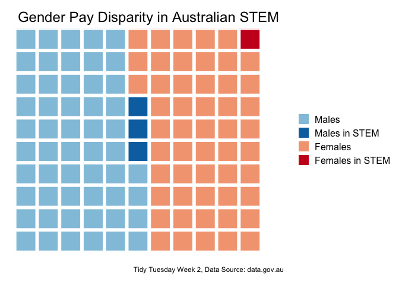

Tidy Tuesday 4:
================
Dana Seidel
5/18/2018

Load data and libraries
-----------------------

``` r
library(tidyverse)
```

    ## ── Attaching packages ───────────────────────────────────────────────────────────── tidyverse 1.2.1 ──

    ## ✔ ggplot2 2.2.1.9000     ✔ purrr   0.2.4     
    ## ✔ tibble  1.4.2          ✔ dplyr   0.7.4     
    ## ✔ tidyr   0.8.0          ✔ stringr 1.3.0     
    ## ✔ readr   1.1.1          ✔ forcats 0.3.0

    ## ── Conflicts ──────────────────────────────────────────────────────────────── tidyverse_conflicts() ──
    ## ✖ dplyr::filter() masks stats::filter()
    ## ✖ dplyr::lag()    masks stats::lag()
    ## ✖ dplyr::vars()   masks ggplot2::vars()

``` r
library(printr)

salaries <- read_csv("../data/week4_australian_salary.csv")
```

    ## Warning: Missing column names filled in: 'X1' [1]

    ## Parsed with column specification:
    ## cols(
    ##   X1 = col_integer(),
    ##   gender_rank = col_integer(),
    ##   occupation = col_character(),
    ##   gender = col_character(),
    ##   individuals = col_integer(),
    ##   average_taxable_income = col_integer()
    ## )

``` r
# looks like we are likely going to need some stringr to categorize these.

# Let's look at just STEM fields broadly
STEM <- salaries %>% 
  filter(str_detect(occupation, "scien") | str_detect(occupation, "comput") |
       str_detect(occupation, "engineer") | str_detect(occupation, "medic"),  
       !(str_detect(occupation, "s*ales")))


# Build that into the salaries df directly
df_sal <- salaries %>% 
  mutate(STEM = ifelse(
    (str_detect(occupation, "scien") | str_detect(occupation, "comput") |
       str_detect(occupation, "engineer") | str_detect(occupation, "medic") & 
       !(str_detect(occupation, "s*ales"))), 1, 0))
```

Let's look at gender disparity in these STEM fields
===================================================

``` r
# what are those numbers actually?
STEM_gender_disparity <- salaries %>%
  group_by(gender) %>%
  summarise(total = sum(individuals)) %>%
  ungroup() %>%
  mutate(
    STEMtotals = (STEM %>% group_by(gender) %>% summarise(total = sum(individuals)) %>% pull(total)), # is there a cleaner way to do this? Probably a mutate earlier on
    percent_gender = STEMtotals / total * 100,
    percent_total = STEMtotals / sum(total) * 100
  )

STEM_gender_disparity
```

| gender |    total|  STEMtotals|  percent\_gender|  percent\_total|
|:-------|--------:|-----------:|----------------:|---------------:|
| Female |  4915857|      138230|         2.811921|        1.343328|
| Male   |  5374260|      358827|         6.676770|        3.487103|

``` r
# this is ugly but effective
gender_ratios <- c(
  STEM_ratio = STEM_gender_disparity[2, "STEMtotals"] / STEM_gender_disparity[1, "STEMtotals"],
  total_ratio = STEM_gender_disparity[2, "total"] / STEM_gender_disparity[1, "total"]
)
#gender_ratios

# what's a better way than bar charts for looking at proportions? waffle charts!
# I want to account for STEM versus not STEM and also Male versus Female.

#install.packages("waffle")
library(waffle) 
parts <- df_sal %>% 
  group_by(gender, STEM) %>% 
  summarise(total = sum(individuals)) %>% pull(total)
names(parts) <- c("Females", "Females in STEM", "Males", "Males in STEM")
parts <- c(parts[3:4], parts[1:2]) # hacky reorder


waffle(parts/91500, # resize
       colors = c("#92c5de", "#0571b0", "#f4a582", "#ca0020")) +
   theme(plot.title = element_text(size = 18, hjust = .4),
         legend.text = element_text(size = 12)) +
  labs(
      x = "", y = "",
      title = "Gender Disparity in STEM Fields",
      caption = "Tidy Tuesday Week 2, Data Source: data.gov.au"
    )
```



Really makes the ratios stand out!

Now for pay disparity...
========================

``` r
parts <- df_sal %>% 
  mutate(total_income = as.numeric(individuals)*as.numeric(average_taxable_income)) %>% 
  group_by(gender, STEM) %>% 
  summarise(total = sum(total_income, na.rm = T)) %>% pull(total)
names(parts) <- c("Female $$", "Female STEM $$", "Male $$", "Male STEM $$")
parts <- c(parts[3:4], parts[1:2]) # hacky reorder


waffle(parts/5700000000, # resize
       colors = c("#92c5de", "#0571b0", "#f4a582", "#ca0020")) +
   theme(plot.title = element_text(size = 18, hjust = .4),
         legend.text = element_text(size = 12)) +
  labs(
      x = "", y = "",
      title = "Gender Pay Disparity in Australian STEM",
      caption = "Tidy Tuesday Week 2, Data Source: data.gov.au"
    )
```


