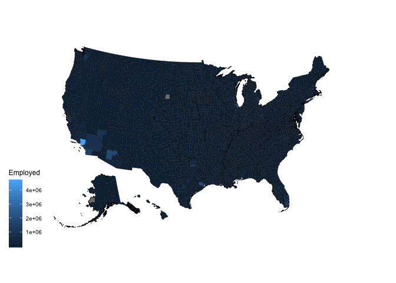
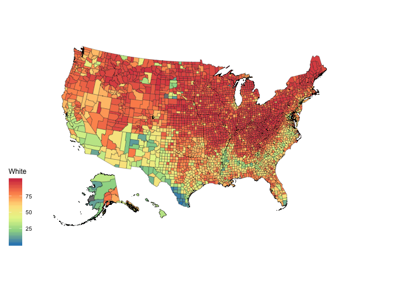
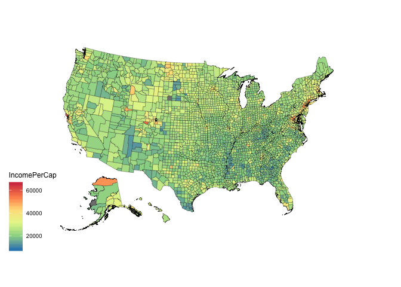
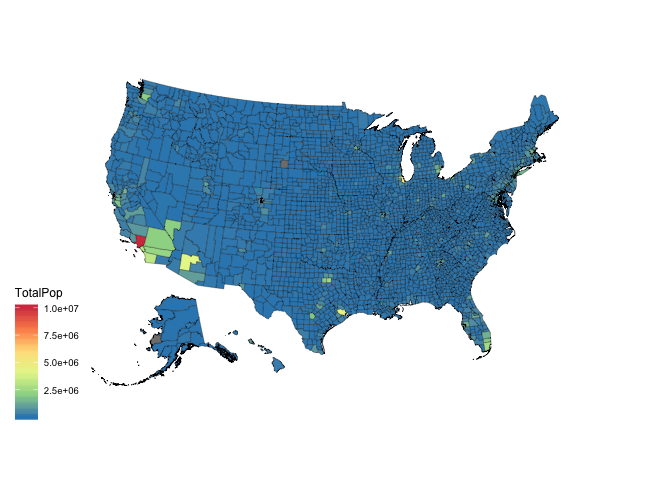
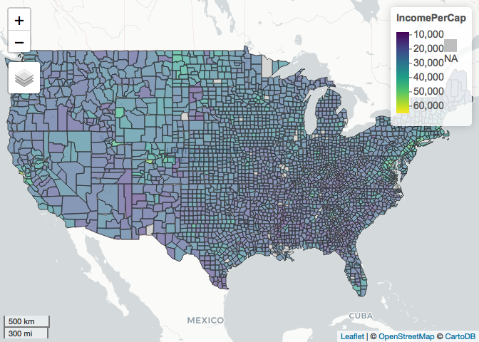

2015 Census Tracts
================

Load the libraries and data
===========================

``` r
library(tidyverse)
library(ggthemes)
library(usmapdata)

acs <- read_csv("../data/acs2015_county_data.csv")
```

Playing with census data
========================

This week I'm shamelessly taking my dear friend Sara's (@sastoudt) Week5 function and doing a few small edits to adapt it for tidy evaluation. Shout out to the original author @AidoBo, from whose code she originally adapted her functions. I've been trying to teach myself how to program with dplyr for several months, but it hasn't quite stuck yet. I do a lot of googling and given how fast the development is on this side, I'm never sure if my answers are the current best practice. But today all I ended up needed was a simple `rlang::quo_text` call and the `aes_string` functionality in ggplot2.

I also did some googling to adapt the base map to include Alaska and Hawaii since there seemed no reason to throw out perfectly good census data. It's unfortunate the maps package doesn't seem to include the non-contiguous states but there are a number of packages trying to fill this gap `usdata`, `usmapdata`, and `fiftystater` to name a few.

``` r
# idea/chunk adapted from @AidoBo & @sastoudt
# https://twitter.com/AidoBo/status/991338257391804416

#first off I want hawaii and Alaksa!
#devtools::install_github("jjchern/usmapdata")

counties <- usmapdata::county %>% mutate(CensusId = as.integer(id))
all_county <- left_join(counties, acs)

ggplot() +
  geom_map(data = all_county, map = all_county,
           aes(x = long, y = lat, map_id = id, fill = Employed),
           color="black",  size=0.1) +
  coord_map("albers", lat0 = 30, lat1 = 40) +
  ggthemes::theme_map()
```



``` r
# functional programming!
county_plot <- function(var) {
  var_enq <- enquo(var) ## add a little programming with dyplr
  ggplot() + 
    geom_map(data = all_county, map = usmapdata::county,
           aes_string(x = "long", y = "lat", map_id = "id", 
                      fill = rlang::quo_text(var_enq)),
           color="black",  size=0.1) +
  coord_map("albers", lat0 = 30, lat1 = 40) +
  ggthemes::theme_map() +
  scale_fill_distiller(palette="Spectral")
}

names(all_county)
```

    ##  [1] "long"            "lat"             "order"          
    ##  [4] "hole"            "piece"           "group"          
    ##  [7] "id"              "CensusId"        "State"          
    ## [10] "County"          "TotalPop"        "Men"            
    ## [13] "Women"           "Hispanic"        "White"          
    ## [16] "Black"           "Native"          "Asian"          
    ## [19] "Pacific"         "Citizen"         "Income"         
    ## [22] "IncomeErr"       "IncomePerCap"    "IncomePerCapErr"
    ## [25] "Poverty"         "ChildPoverty"    "Professional"   
    ## [28] "Service"         "Office"          "Construction"   
    ## [31] "Production"      "Drive"           "Carpool"        
    ## [34] "Transit"         "Walk"            "OtherTransp"    
    ## [37] "WorkAtHome"      "MeanCommute"     "Employed"       
    ## [40] "PrivateWork"     "PublicWork"      "SelfEmployed"   
    ## [43] "FamilyWork"      "Unemployment"

``` r
county_plot(White)
```



``` r
county_plot(Men/Women)  # dating ratios baby!
```


``` r
county_plot(IncomePerCap)
```



``` r
county_plot(TotalPop)
```



I've played a little with `plotly` and would love to make its `tooltip` columns dynamically programmed but that might be a bit much for me right now. Instead, I thought I would play with `sf` and `mapview` a bit.

I'd still like to make this interactive -- so you can chose a new column to display from a dropdown... but the only way I can think to do that is with a shiny app. I wonder if that is doable in `leaflet` or `mapview` proper. For now, I can add them individuals as layers and "burst"... then they are interactive in the layer menu and can be turned on or off. Not perfect but a neat option when you don't want to build out a full custom webapp.

``` r
library(mapview)

lower48_sf <- sf::st_as_sf(maps::map("county", plot = FALSE, fill = TRUE)) %>% 
  left_join(all_county %>% 
              mutate(ID= paste(tolower(State), tolower(County),sep=",")) %>% 
              select(-c(1:6)) %>% distinct)


m <- mapview(lower48_sf,
             zcol = c("IncomePerCap", "Poverty", "Hispanic", 
                      "White", "Men", "Women"),
        burst = T,
        hide = T, 
        legend = T, 
        homebutton = F)

m
```


